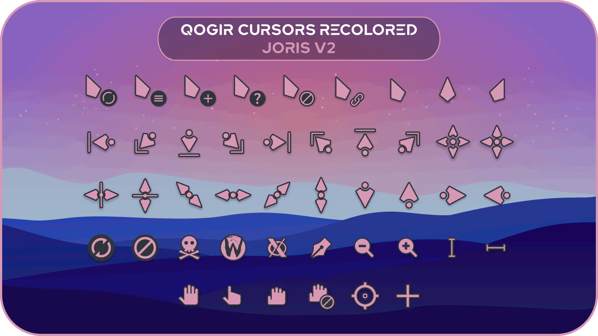
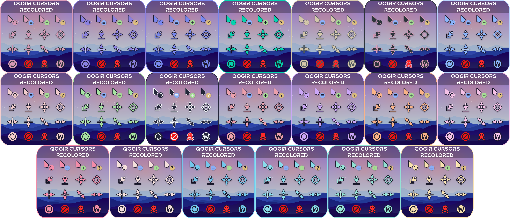

<div align = center>

# Qogir cursors
This is an x-cursor theme inspired by the original [**Qogir Cursor pack**](https://github.com/vinceliuice/Qogir-icon-theme/tree/master/src/cursors) but recolored, originally based on the [**capitaine-cursors**](https://github.com/keeferrourke/capitaine-cursors).


I enjoyed using this cursor pack and then thought it would be a good idea to make special colors for myself and others. If you'd like to suggest colors you'd like, please submit a request.

If you prefer rounded cursors, check out: [**Afterglow Cursors Recolored**](https://github.com/TeddyBearKilla/Afterglow-Cursors-Recolored)

If you'd like to support me on Ko-fi it's appreciated, takes time to make each recolor and test them.
You can also request commisions there and I'll go trough the whole process of making a custom color for you with various additions.

<p align="center"> <a href="https://ko-fi.com/teddybearkilla" target="_blank" rel="noreferrer">  </a></p>
</div>

## Installation
To install the cursor theme simply copy the compiled theme to your icons
directory. Same with alternative colors.

If you `git clone` my repo or download the [**latest release**](https://github.com/TeddyBearKilla/Qogir-Cursors-Recolored/releases/tag/Latest-release), go into any `color` and use:

For local user installation: `./install.sh`

For system-wide installation for all users: `sudo ./install.sh`


Alternatively you can download the tar.gz of the color you want in the [**releases**](https://github.com/TeddyBearKilla/Afterglow-Cursors-Recolored/releases)
then extract it in
`.local/share/icons` or `/usr/share/icons` (system wide)

Then set the theme with your preferred desktop settings tool.

## Installation (Debian 12)

For proper installation in Debian 12 (bookworm), you also need to install Gtk+ libcanberra
bindings, to do this, install:

```shell
sudo apt install libcanberra-gtk-module libcanberra-gtk3-module
```
or
```shell
sudo apt-get install libcanberra-gtk*
```

If you want to apply this default cursor to gdm3 just edit the file
`/etc/gdm3/greeter.dconf-defaults` and add or change `cursor-theme` line:

```shell
# Theming options
# ===============
#  - Change the GTK+ theme
[org/gnome/desktop/interface]
# gtk-theme='Adwaita'
cursor-theme='Qogir-Recolored-Joris' <-- here
...
```

Enjoy! And many thanks to [**coffeewasmyidea**](https://github.com/coffeewasmyidea) for forking and adding the tutorial!

<!--
## Installation (Windows)

Download the Zip file of the color you prefer in the [Releases: Alt Colors Catppuccin (Windows)](https://github.com/TeddyBearKilla/Afterglow-Cursors-Recolored/releases/tag/Windows-Catppuccin)

Extract it anywhere.

Right click `install.inf`

Go to your mouse settings & change it.

Enjoy! And many thanks to [**Mojas84**](https://github.com/Mojas84) for converting them to windows & [**Ripley**](https://github.com/ripl3yy) for test installing them on windows & helping me figure out the steps!-->

## Building from source / Customize the Cursor
You'll find everything you need to build and modify this cursor set in
the `src/` directory. You'll need [**Inkscape**](https://inkscape.org/) installed. To build the xcursor theme from the SVG source
run:

```
./build.sh
```

This will generate the pixmaps and appropriate aliases.
The freshly compiled cursor theme will be located in `dist/`

# Found issues & Fixes
- AMD GPUs (Found & Fixed by [**Joris**](https://jorisvandijk.com/))

If you have an AMD card and your cursor's color is off (oversaturated), or flickering when hovering over things adding the following to your `/etc/X11/xorg.conf.d/20-amdgpu.conf` file will likely solve it.
```
Section "OutputClass"
     Identifier "AMD"
     MatchDriver "amdgpu"
     Driver "amdgpu"
     Option "SWCursor" "True"
     Option "TearFree" "True"
EndSection
```


<div align = center>

# Preview

### (Check [/previews](https://github.com/TeddyBearKilla/Qogir-Cursors-Recolored/tree/main/previews) for all colors)

# All cursors made as of August 24th

</div>
